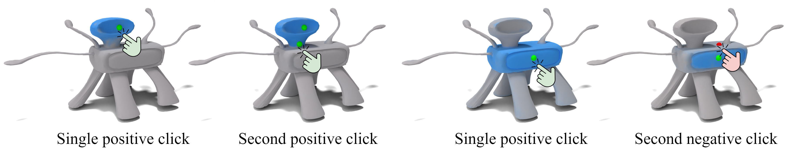

# iSeg: Interactive 3D Segmentation via Interactive Attention

[Itai Lang](https://itailang.github.io/)\*, [Fei Xu](https://github.com/FeiXu-spacetime)\*, [Dale Decatur](https://ddecatur.github.io/), [Sudarshan Babu](https://github.com/sudarshan1994), [Rana Hanocka](https://people.cs.uchicago.edu/~ranahanocka/)
<br>
\*Equal contribution

University of Chicago

<a href="https://threedle.github.io/iSeg/"></a>
<a href="https://arxiv.org/abs/2404.03219"></a>



## Abstract
We present iSeg, a new interactive technique for segmenting 3D shapes. Previous works have focused mainly on leveraging pre-trained 2D foundation models for 3D segmentation based on text. However, text may be insufficient for accurately describing fine-grained spatial segmentations. Moreover, achieving a consistent 3D segmentation using a 2D model is challenging since occluded areas of the same semantic region may not be visible together from any 2D view. Thus, we design a segmentation method conditioned on fine user clicks, which operates entirely in 3D. Our system accepts user clicks directly on the shape's surface, indicating the inclusion or exclusion of regions from the desired shape partition. To accommodate various click settings, we propose a novel interactive attention module capable of processing different numbers and types of clicks, enabling the training of a single unified interactive segmentation model. We apply iSeg to a myriad of shapes from different domains, demonstrating its versatility and faithfulness to the user's specifications.

## Installation
Clone this repository:
```bash
git clone https://github.com/threedle/iSeg.git
cd iSeg/
```

Create and activate a conda environment:
```bash
conda create -n iseg python=3.9.18 --yes
conda activate iseg
```

Install the required packages:
```bash
sh ./install_environment.sh
```

Note: the installation assumes a machine with GPU and CUDA.

## Demo
This demo shows how to run a pre-trained iSeg model for interactive segmentation of a `hammer` mesh.

Downlod the demo data:
```bash
bash download_demo_data.sh
```

* The `hammer` mesh will be stored at `./meshes/hammer.obj`.

* The pre-trained vertex features will be stored at `./demo/hammer/encoder/pred_f.pth`. 

* The pre-trained decoder model will be stored at `./demo/hammer/decoder/decoder_checkpoint.pth`.

If you experience issues with the script, download directly the [mesh](https://drive.google.com/file/d/1u8GJ7cT7_5hQlplj-5_pYh16m86GdF99/view?usp=sharing), [features](https://drive.google.com/file/d/13bhW6FDzLs4UAQAyaR6N6w1efK41Z8M3/view?usp=sharing), and [checkpoint](https://drive.google.com/file/d/1WWu0NO1pZpS39_tNCAhFD77RSotyq5E4/view?usp=sharing), and store them under the corresponding folders.

Run the decoder with a single click on vertex 5141:
```bash
python decoder.py --mode test --save_dir ./demo/hammer/decoder/ --model_name decoder_checkpoint.pth --encoder_f_path ./demo/hammer/encoder/pred_f.pth --obj_path ./meshes/hammer.obj --select_vertices 5141
```

Run the decoder with a first positive click on vertex 5141 and a second positive click on vertex 61:
```bash
python decoder.py --mode test --save_dir ./demo/hammer/decoder/ --model_name decoder_checkpoint.pth --encoder_f_path ./demo/hammer/encoder/pred_f.pth --obj_path ./meshes/hammer.obj --select_vertices 5141 61
```

Run the decoder with a first positive click on vertex 5141 and a second negative click on vertex 10795:
```bash
python decoder.py --mode test --save_dir ./demo/hammer/decoder/ --model_name decoder_checkpoint.pth --encoder_f_path ./demo/hammer/encoder/pred_f.pth --obj_path ./meshes/hammer.obj --select_vertices 5141 -10795
```

For each run, the per-vertex predicted probability (an `npy` file), a mesh colored according to the predicted probabilities (a `ply` file), and rendered views of the colored mesh and the clicked points (a `png` file) will be saved under the folder `./demo/hammer/decoder/`.

Note that you can save the colored mesh with spheres at the clicked points' location by adding the argument `--show_spheres 1` to the commands above.

## Training Instructions
This section explains how to generate data and train the encoder and decoder of iSeg. These items will be exemplified for the `hammer` mesh.

Download the [ViT-H SAM model](https://dl.fbaipublicfiles.com/segment_anything/sam_vit_h_4b8939.pth) (simply click on the link). Put the downloaded file `sam_vit_h_4b8939.pth` under the folder `./SAM_repo/model_checkpoints/`.

Generate data for training the encoder:
```bash
python encoder.py --obj_path ./meshes/hammer.obj --name hammer --encoder_data_dir ./data/hammer/encoder_data --generate_random_views 1 --start_training 0 --test 0
```

The data will be saved under the folder `./data/hammer/encoder_data/`.

Train the encoder:
```bash
python encoder.py --obj_path ./meshes/hammer.obj --name hammer --encoder_data_dir ./data/hammer/encoder_data --encoder_model_dir ./experiments/hammer/encoder --generate_random_views 0 --num_epochs 3 --start_training 1 --test 1
```

The predicted encoder features per mesh vertex will be saved to `./experiments/hammer/encoder/pred_f.pth`. These features will be used during the decoder training.

Generate data for training the decoder (single click and couple of clicks):
```bash
python data_generation.py --name hammer --obj_path ./meshes/hammer.obj --decoder_data_dir ./data/hammer/decoder_data --single_click 1 --second_positive 1 --second_negative 1
```

If you want to generate only single click data, set the arguments `--second_positive 0` and `--second_negative 0`.

The data will be saved under the folder `./data/hammer/decoder_data/`.

Train the decoder:
```bash
python decoder.py --obj_path ./meshes/hammer.obj --encoder_f_path ./experiments/hammer/encoder/pred_f.pth --decoder_data_dir ./data/hammer/decoder_data --save_dir ./experiments/hammer/decoder/ --model_name decoder_checkpoint.pth --mode train --num_epochs 5 --use_positive_click 1 --use_negative_click 1
```

If you generated only single click data, set the arguments `--use_positive_click 0` and `--use_negative_click 0`.

The decoder model will be saved to `./experiments/hammer/decoder/decoder/decoder_checkpoint.pth`

To evaluate the trained decoder, see the instuctions in the [Demo](#demo) section.

## Citation
If you find iSeg useful for your work, please consider citing:
```
@article{lang2024iseg,
    author  = {Lang, Itai and Xu, Fei and Decatur, Dale and Babu, Sudarshan and Hanocka, Rana},
    title   = {{iSeg: Interactive 3D Segmentation via Interactive Attention}},
    journal = {arXiv preprint arXiv:2404.03219},
    year    = {2024}
}
```
